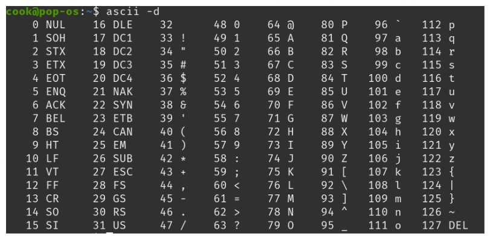
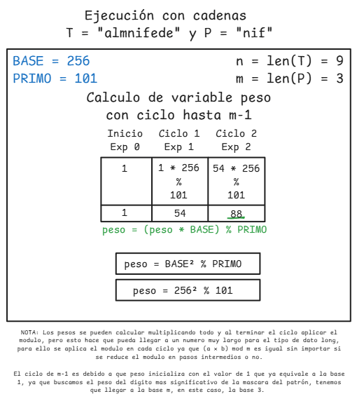
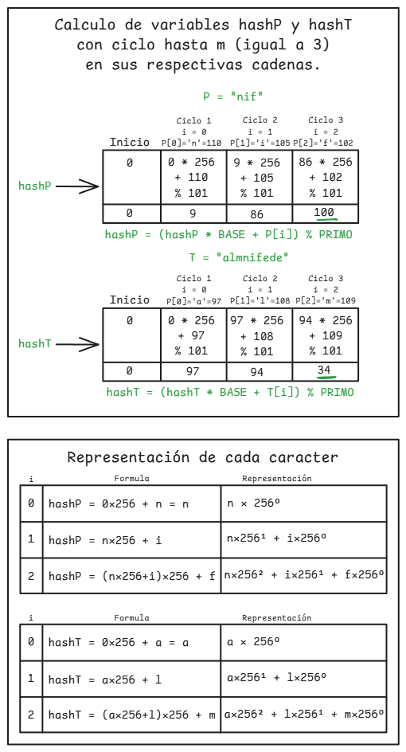
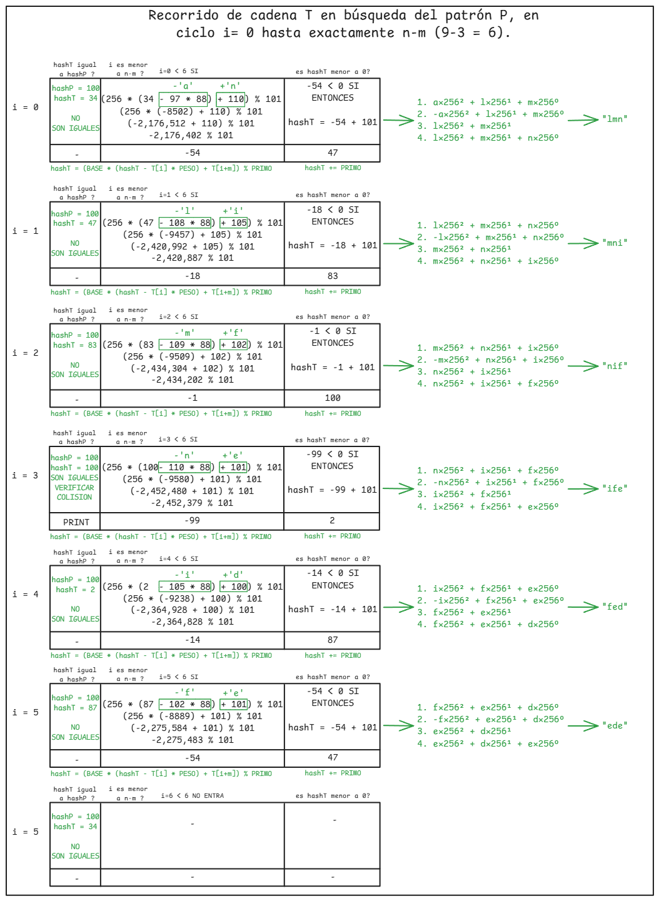
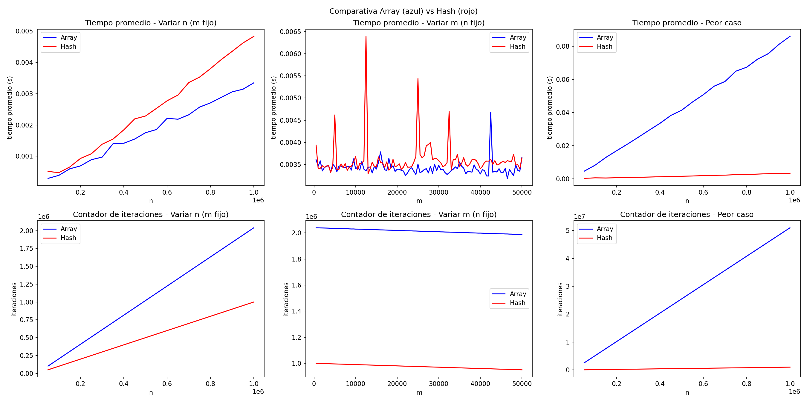

# String Matching — Fuerza Bruta contra Hash

Este repositorio contiene un estudio experimental realizado para la materia de **Análisis y Diseño de Algoritmos**, donde se evalúa el problema de encontrar todas las apariciones de un patrón `P` (longitud `m`) dentro de un texto `T` (longitud `n`), comparando la búsqueda por fuerza bruta contra la utilizacion de una funcion hash para evitar comparar carácter por carácter en la mayoría de las posiciones.

## Introducción

El objetivo de esta actividad es implementar ambas estrategias y analizar experimentalmente en qué condiciones el hash realmente ofrece una ventaja sobre la fuerza bruta con corte temprano.

**Algoritmos analizados:**
* Fuerza bruta con corte temprano (`string_matching_array.c` / `string_matching_array_exp.c`).
* Rabin-Karp con hash móvil (`string_matching_hash.c` / `string_matching_hash_exp.c`).

### Metodología
Se diseñaron **3 experimentos**, cada uno con 30 repeticiones y promedio truncado (eliminando el mejor y el peor caso):

1. **Variar `n` (patrón fijo de `m=50`)** — texto aleatorio, de 50,000 a 1,000,000 caracteres.
2. **Variar `m` (texto fijo de `n=1,000,000`)** — patrón de 500 a 50,000 caracteres.
3. **Peor caso** — texto adversarial ("aaaa...ab") diseñado para forzar el peor caso de la fuerza bruta (coincidencias parciales largas en casi todas las posiciones), variando `n` de 50,000 a 1,000,000.

En los tres casos, el patrón se toma de los últimos caracteres del texto, garantizando exactamente una coincidencia real al final.

### Entorno de Pruebas
Las pruebas se ejecutaron en un equipo con las siguientes especificaciones técnicas:
* **RAM:** *(completar)*
* **Procesador:** *(completar)*

---

## Descripción de los Algoritmos

### 1. Fuerza Bruta con Corte Temprano
Para cada posición `i` del texto, compara carácter por carácter contra el patrón, abandonando la comparación en cuanto encuentra una diferencia:
```c
for (long i = 0; i <= n - m; i++) {
    long j;
    for (j = 0; j < m; j++) {
        if (T[i + j] != P[j]) break;   // corte temprano
    }
    if (j == m) { /* coincidencia en i */ }
}
```
* **Complejidad (peor caso):** $O(n \cdot m)$ — si el texto tiene coincidencias parciales largas en casi todas las posiciones (como el texto adversarial de este experimento).
* **Complejidad (caso promedio):** $O(n)$ — con texto aleatorio, la comparación falla casi de inmediato en la mayoría de las posiciones.

### 2. Rabin-Karp (hash móvil)
En vez de comparar carácter por carácter en cada posición, calcula un **hash numérico** del patrón y de cada ventana de `m` caracteres del texto. Solo si los hashes coinciden se hace la comparación literal (para descartar colisiones):
```c
for (long i = 0; i <= n - m; i++) {
    if (hashT == hashP) {
        if (strncmp(T + i, P, m) == 0) { /* coincidencia confirmada en i */ }
    }
    if (i < n - m) {
        // desplazamiento: recalcula el hash de la siguiente ventana en O(1)
        hashT = (BASE * (hashT - T[i] * peso) + T[i + m]) % PRIMO;
        if (hashT < 0) hashT += PRIMO;
    }
}
```
* **Complejidad (caso promedio):** $O(n + m)$ — el hash de cada ventana se actualiza en O(1) por posición (el "desplazamiento"), y las colisiones de hash son raras con un `PRIMO` grande.
* **Complejidad (peor caso):** $O(n \cdot m)$ — si el hash colisiona en casi todas las posiciones (poco probable con buenos parámetros de `BASE`/`PRIMO`, pero posible con un adversario que conozca esos parámetros).

---

## Cálculo del Hash

### Representación numérica de los caracteres (ASCII)
Cada carácter se trata como su valor numérico ASCII para poder operar aritméticamente sobre la cadena (`BASE = 256` porque un byte tiene 256 valores posibles).



### Cálculo de la variable `peso`
Antes de recorrer el texto, se calcula `peso = BASE^(m-1) mod PRIMO`: el valor que tiene el dígito **más significativo** de la ventana (el primer carácter) dentro del hash. Este valor es el que se usa después para "quitar" ese carácter del hash al desplazar la ventana una posición.



### Cálculo inicial de `hashP` y `hashT`
El hash de una cadena se calcula tratándola como un número en base 256 (similar a como un número decimal se arma dígito por dígito): `hash = (hash * BASE + caracter) % PRIMO`, aplicado carácter por carácter tanto al patrón `P` como a la primera ventana de `T`.



### Desplazamiento
En vez de recalcular el hash completo de cada ventana desde cero (lo que costaría O(m) por posición, degenerando de nuevo a O(n·m)), reutilizamos el hash de la ventana anterior, le resta la contribución del carácter que sale (`T[i] * peso`), recorre un dígito hacia la izquierda (`* BASE`), y suma el carácter que entra (`+ T[i+m]`). Esto convierte el recálculo de cada ventana en una operación **O(1)**, que es justo lo que permite que el ciclo principal completo sea O(n) en vez de O(n·m).

La siguiente traza manual ejecuta el algoritmo completo sobre `T = "almnifede"` y `P = "nif"`, mostrando cómo el hash se desplaza ventana por ventana (incluyendo el caso de un hash negativo tras la resta, que se normaliza sumando `PRIMO`) hasta encontrar la coincidencia real en `i = 3` ("nif" dentro de "almnifede"):



---

## Resultados

| Experimento | n | m | Array — Iteraciones | Array — Tiempo (s) | Hash — Iteraciones | Hash — Tiempo (s) |
| :--- | :-- | :-- | :-- | :-- | :-- | :-- |
| Variar n (caso promedio) | 50,000 | 50 | 101,939 | 0.00029093 | 49,951 | 0.00051336 |
| Variar n (caso promedio) | **1,000,000** | 50 | **2,039,922** | **0.00334739** | **999,951** | **0.00483400** |
| Variar m | 1,000,000 | 500 | 2,039,528 | 0.00360457 | 999,501 | 0.00393543 |
| Variar m | 1,000,000 | 50,000 | 1,987,875 | 0.00366071 | 950,001 | 0.00364811 |
| **Peor caso (adversarial)** | 50,000 | 50 | 2,547,501 | 0.00466850 | 49,951 | 0.00034814 |
| **Peor caso (adversarial)** | **1,000,000** | 50 | **50,997,501** | **0.08590689** | **999,951** | **0.00343061** |

*(valores completos en `Datos/Array_*.csv` y `Datos/Hash_*.csv`)*

### Gráfica Comparativa


---

## Conclusiones

* **Con texto aleatorio, ambos algoritmos son cercanos, pero el Array gana en tiempo:** en los paneles "Variar n" y "Variar m", Array resulta un poco más rápido que Hash en tiempo de pared, aunque Hash necesita **menos de la mitad de iteraciones** (999,951 contra 2,039,922), así que cada "iteración" de Array es más barata (una simple comparación de char) que cada "iteración" de Hash (una operación aritmética con multiplicación y módulo), aunque Array necesite hacer más de ellas.

* **En el peor caso, hash gana:** con el texto "aaaa...ab", Array degenera a su complejidad de peor caso $O(n \cdot m)$, casi 51 millones de iteraciones y 0.086 s en `n=1,000,000`, mientras que Hash se mantiene exactamente igual que en el caso promedio (999,951 iteraciones, 0.0034 s), sin verse afectado en absoluto por el patrón adversarial, de manera que la ventaja de hash es de **~25x en tiempo** y **~51x en iteraciones**.

* **El desplazamiento de valores hash:** al costar O(1) actualizar el hash de una ventana a la siguiente (en vez de recalcularlo desde cero), hash evita que un patrón con muchas coincidencias parciales (como el texto adversarial) degrade su rendimiento, su costo depende únicamente de `n`, no de cuántos caracteres del patrón coinciden en cada posición.

Por lo que la elección del algortimo depende del tipo de entrada. Para texto genérico donde no se anticipan patrones adversariales, la fuerza bruta con corte temprano es más simple y ligeramente más rápida en tiempo real (aunque haga más iteraciones). Cuando el texto podría estar diseñado (intencional o accidentalmente) para generar muchas coincidencias parciales, utilizar funciones hash tiene un rendimiento muy superior.